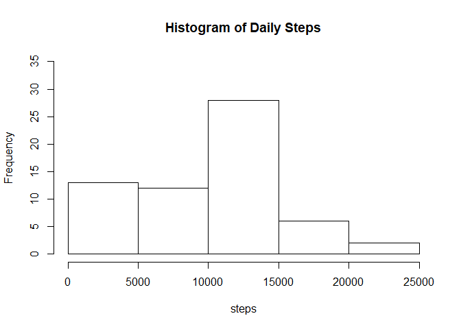
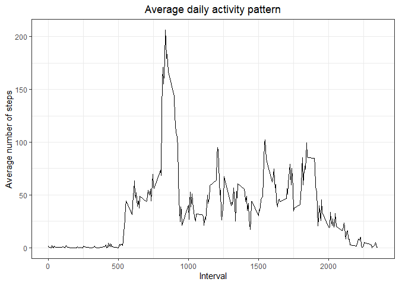
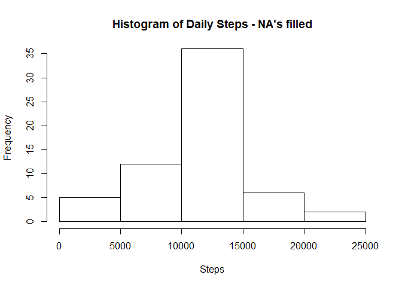
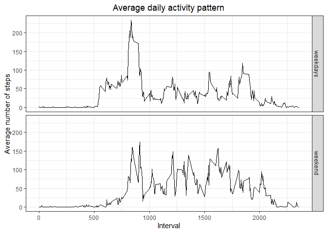

## Loading and preprocessing the data

First of all, we import the data from our workspace.


```r
data <- read.csv("activity.csv", na.strings = "NA")
```


Then, we can format the variable related with dates.


```r
data$date <- as.Date(data$date, "%Y-%m-%d")
```

Now we can see the contents of our data with the command str.


```r
str(data)
```

```
## 'data.frame':	17568 obs. of  3 variables:
##  $ steps   : int  NA NA NA NA NA NA NA NA NA NA ...
##  $ date    : Date, format: "2012-10-01" "2012-10-01" ...
##  $ interval: int  0 5 10 15 20 25 30 35 40 45 ...
```

## What is mean total number of steps taken per day?

First we plot an histogram withthe daily steps. With tapply function we calculate the steps and with hist function we plot them.


```r
steps <- tapply(data$steps, data$date, sum, na.rm = TRUE)
hist(steps, main = "Histogram of Daily Steps", ylim = c(0,35))
```

<!-- -->
Now we can calculate both, mean and median of daily steps.


```r
mean(steps)  
```

```
## [1] 9354.23
```

```r
median(steps)  
```

```
## [1] 10395
```


## What is the average daily activity pattern?

To answer this question, we transform our data calculating the average of steps taken.


```r
library(dplyr)
```


```r
finaldata <- data %>% group_by(interval) %>% summarize(meansteps = mean(steps, na.rm = TRUE))
head(finaldata)
```

```
## # A tibble: 6 x 2
##   interval meansteps
##      <int>     <dbl>
## 1        0    1.72  
## 2        5    0.340 
## 3       10    0.132 
## 4       15    0.151 
## 5       20    0.0755
## 6       25    2.09
```

Then we can plot the data properly with ggplot2 package.


```r
library(ggplot2)
```


```r
ggplot(finaldata, aes(interval,meansteps)) + geom_line() + labs(title = "Average daily activity pattern", x = "Interval", y = "Average number of steps") + theme_bw() + theme(plot.title = element_text(hjust = 0.5))
```

<!-- -->

FInally, to find the 5-minute interval with the maximum number of steps, we can use the max function.


```r
maxsteps <- max(finaldata$meansteps)
maxinterval <- finaldata[which.max(finaldata$meansteps),1]

maxsteps
```

```
## [1] 206.1698
```

```r
maxinterval
```

```
## # A tibble: 1 x 1
##   interval
##      <int>
## 1      835
```

We conclude that the 5-minute interval with the maximum number of steps is the #835, with 206.17 steps in average.

## Imputing missing values

First, we can report the total number of missing values in the data set like this:


```r
sum(is.na(data))
```

```
## [1] 2304
```

```r
sum(is.na(data$steps))
```

```
## [1] 2304
```

Next, knowing that NA values are present just in the steps variable, the strategy taken to fill this NA values is calculate the average of steps taken in the corresponding interval.


```r
means <- data %>% group_by(interval) %>% summarize(meansteps = mean(steps, na.rm = TRUE))

newdata <- data %>% group_by(interval) %>% mutate(steps = ifelse(is.na(steps), mean(steps, na.rm = TRUE), steps))
```

With this new data we can plot a hist with of the total number of steps taken each day per day.


```r
newsteps <- tapply(newdata$steps, newdata$date, sum)
hist(newsteps, main = "Histogram of Daily Steps - NA's filled", xlab = "Steps", ylim = c(0,35))
```

<!-- -->

Compared to the previous data, the total number of steps taken each day is greater. This happens because, when NA's are replaced, now they are summing to the total daily steps.

## Are there differences in activity patterns between weekdays and weekends?

To answer this question, we can create a new auxiliary variable called "weekday", which will tell us the weekday of the observation according to its date.


```r
Sys.setlocale("LC_TIME", "English")
data$weekday <- weekdays(data$date)
```

Then, we can add a factor variable telling if the weekday corresponds to the weekend or not.


```r
data$factor_week <- as.factor(ifelse(data$weekday == "Saturday" | data$weekday == "Sunday", "weekend","weekdays" ))
```


Now we can see our tranformed data with the command str.


```r
str(data)
```

```
## 'data.frame':	17568 obs. of  5 variables:
##  $ steps      : int  NA NA NA NA NA NA NA NA NA NA ...
##  $ date       : Date, format: "2012-10-01" "2012-10-01" ...
##  $ interval   : int  0 5 10 15 20 25 30 35 40 45 ...
##  $ weekday    : chr  "Monday" "Monday" "Monday" "Monday" ...
##  $ factor_week: Factor w/ 2 levels "weekdays","weekend": 1 1 1 1 1 1 1 1 1 1 ...
```

Finally, with the library dplyr we can transform our data set, with the intention to show the mean of steps taken on each interval and knowing if them are from a weekday or a weekend.


```r
finaldata <- data %>% group_by(factor_week, interval) %>% summarize(meansteps = mean(steps, na.rm = TRUE))
head(finaldata)
```

```
## # A tibble: 6 x 3
## # Groups:   factor_week [1]
##   factor_week interval meansteps
##   <fct>          <int>     <dbl>
## 1 weekdays           0     2.33 
## 2 weekdays           5     0.462
## 3 weekdays          10     0.179
## 4 weekdays          15     0.205
## 5 weekdays          20     0.103
## 6 weekdays          25     1.51
```

Now that we have a suitable data frame, we can plot the results with ggplot2 package.


```r
ggplot(finaldata, aes(interval,meansteps)) + geom_line() + facet_grid(factor_week~.) + labs(title = "Average daily activity pattern", x = "Interval", y = "Average number of steps") + theme_bw() + theme(plot.title = element_text(hjust = 0.5))
```

<!-- -->


